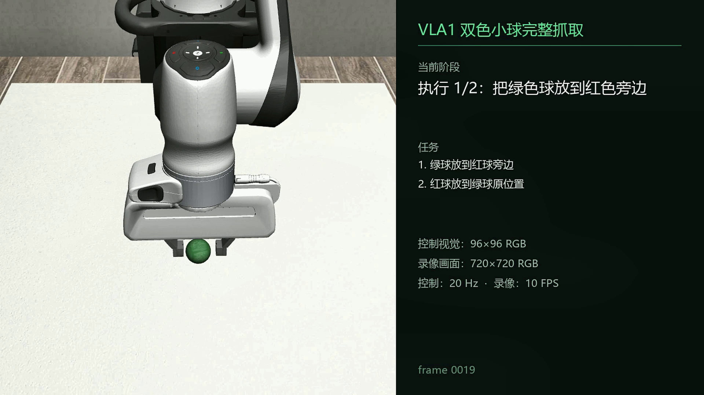

# VLA1 双色小球抓取实验

基于 **MuJoCo + robosuite + Panda** 的视觉语言机械臂复合操作演示：系统读取中文任务指令，使用 RGB 图像定位红、绿两个小球，记忆初始位置，按顺序完成“绿色球放到红色球旁边，再把红色球放到绿色球原位置”。



## 展示证据

- [在线播放：24.9 秒完整成功回放（1920×1080）](https://pichichuan.github.io/vla1-bicolor-ball-grasp-experiment/)
- [下载原始 WebM 回放](artifacts/vla1_complete_grasp_review_clear.webm)
- [同次运行 JSON 指标](artifacts/result.json)
- [本地 HTML 复盘页](artifacts/VLA1双色小球完整抓取复盘.html)

该成功运行的两步放置误差分别为 **0.61 cm** 与 **1.906 cm**，无重试完成。回放、JSON 和指标来自同一次成功运行。

## 系统结构

```text
中文复合指令
  → 规则化任务解析（目标球 / 空间关系 / 顺序）
  → 初始 RGB 场景记忆
  → 颜色分割 + 相机几何定位红绿球
  → 结构化抓取、抬升、移动、放置技能
  → 任务级视觉复核与受限纠偏
  → 两步结果与 JSON 证据
```

### 关键设计

- 控制侧保持 `96×96` RGB 输入，和原模型/视觉模块兼容；
- GUI 额外使用 MuJoCo 离屏 `480×480` 渲染，并通过 Lanczos 缩放显示为 `600×600`，用于清晰演示；
- 任务先记录绿色球的初始视觉位置，再执行“红球放回绿球原位置”，避免第二步错误地使用移动后的绿色球位置；
- 每一步结束后都做 RGB 视觉复核，失败时仅在限定范围内纠偏。

## 运行

环境要求：Python 3.10、MuJoCo、robosuite、NumPy、Pillow。训练/评估脚本另外需要 PyTorch。

```powershell
python -m pip install -r requirements.txt
Set-Location src
python stage8_gui.py
```

GUI 默认指令：

```text
把绿色的球放到红色旁边。再把红色的球放到绿色原来的位置
```

无窗口检查：

```powershell
Set-Location src
python stage8_gui.py --smoke-test
```

重新录制回放：

```powershell
Set-Location src
python record_vla1_complete_review.py
```

## 目录

| 目录/文件 | 用途 |
|---|---|
| `src/stage8_gui.py` | 中文复合指令 GUI；高清演示渲染。 |
| `src/stage8_planner.py` | 复合任务解析、场景记忆、顺序编排和视觉复核。 |
| `src/stage7_vision.py` | RGB 颜色分割与相机几何定位。 |
| `src/stage6_*` / `src/stage7_skill.py` | MuJoCo 双色球环境和抓取/放置技能。 |
| `data/color_grasp_demos.npz` | 双色抓取示教数据。 |
| `checkpoints/color_grasp_vla.pt` | 颜色抓取行为克隆检查点。 |
| `artifacts/` | 成功回放、JSON 证据和 HTML 复盘。 |
| `docs/` | 架构和面试边界说明。 |
